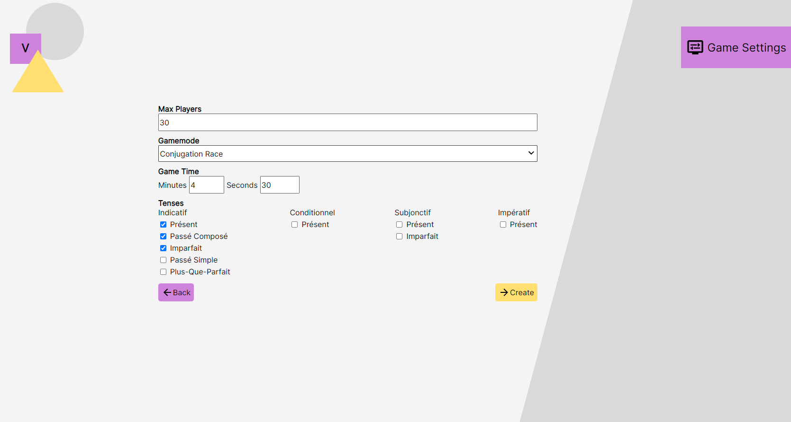
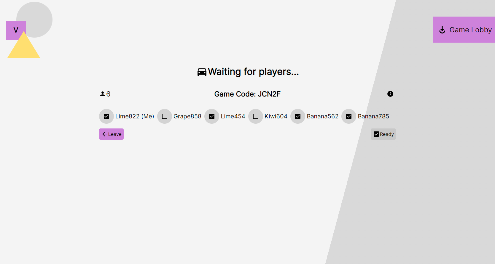
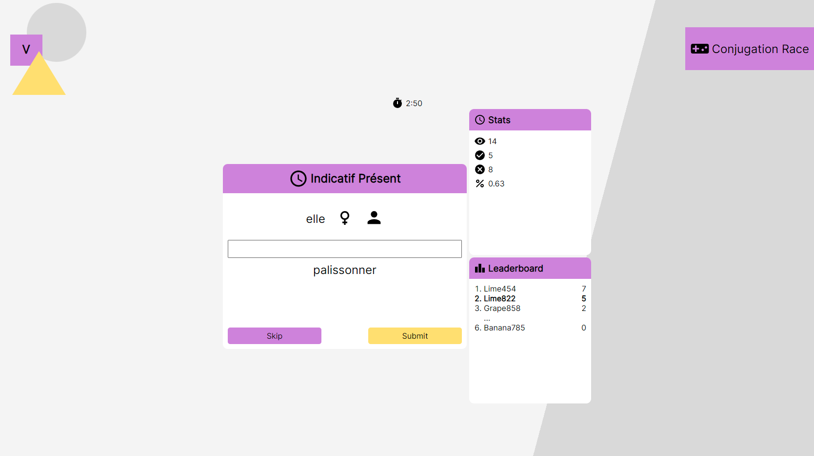
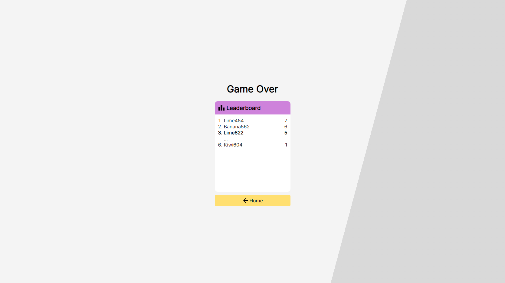

# Verbatim
Compete with others in real-time French language exercises.

[Live deployment](https://kennethtran-verbatim.herokuapp.com/)

## Features

* Create and join real-time games
* Gamemodes:
  1. Conjugation Race

## Installation & Running

Install dependencies:
`
npm install
`

Inside server folder, run to bundle and compile frontend and backend source code:
`
npm run bundle
`

Serve:
`
npm run start
`

## Todo
* Store user data and game logs in database
* More game modes
* Styling changes

## Screenshots

